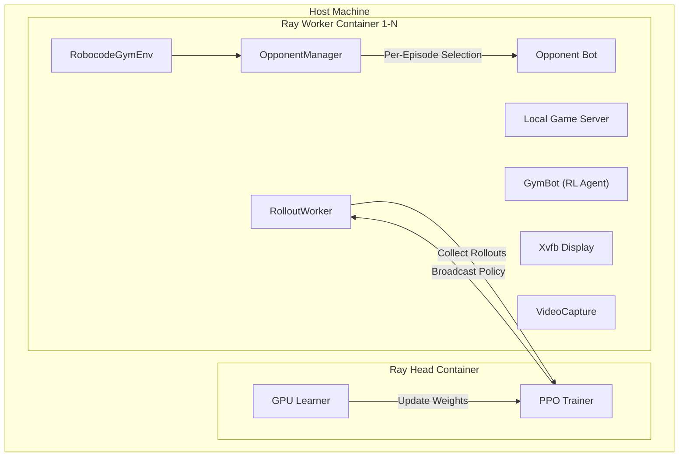
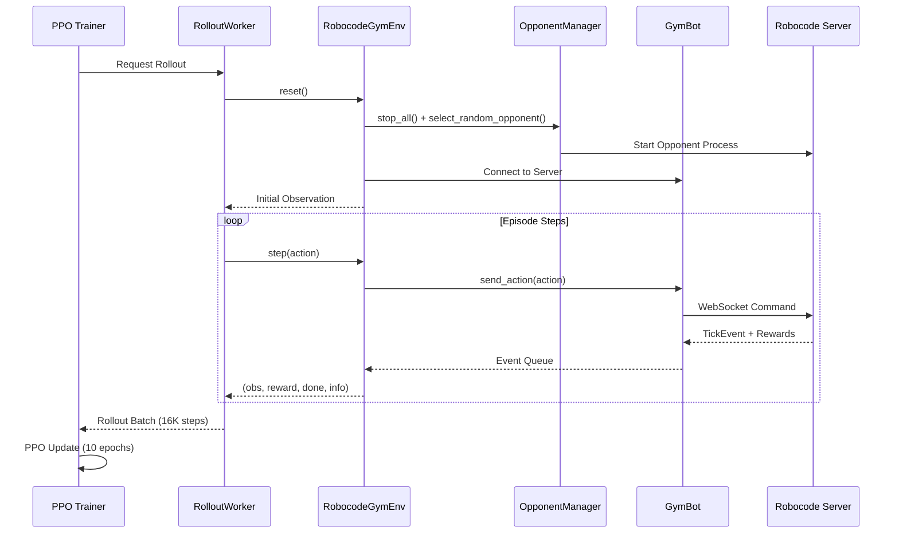

# RoboDojo: Stabilized Robocode RL Training Pipeline

RoboDojo is a high-performance, distributed reinforcement learning pipeline for training Robocode bots. It leverages Ray RLLib for PPO training and Docker for environment isolation, optimized for high-end hardware like the RTX 5090.

## 🏗️ Architecture

The pipeline uses a true distributed Ray cluster with dedicated Docker containers for each worker to ensure 100% environment isolation.

### 1. High-Level Cluster Architecture


### 2. Per-Episode Training Flow


### 3. Component Table

| Component           | Technology          | Responsibility                                   |
| ------------------- | ------------------- | ------------------------------------------------ |
| **PPO Trainer**     | Ray RLLib / PyTorch | Central algorithm and weight updates             |
| **OpponentManager** | Python              | Per-episode random bot selection, crash recovery |
| **Local Server**    | Java (v0.34.2)      | Physics engine and game simulation               |
| **GymBot**          | Python / WebSockets | Async bridge with event buffering                |
| **VideoCapture**    | mss / OpenCV / XVID | Pixel capture + recording (AVI format)           |

### 4. Robustness Features

- **Per-Episode Opponent Selection**: Random opponent from pool each episode
- **Event Buffering**: Accumulates rewards from multiple events per step
- **Timeout Recovery**: Force-reset after 3 consecutive timeouts
- **Crash Recovery**: Auto-restart crashed opponent processes
- **Health Monitoring**: `get_health_status()` for diagnostics

---

## 🚀 User Guide

For detailed instructions on training, deploying, and playing with your bot, see the **[User Guide](USER_GUIDE.md)**.

### Quick Commands
```bash
# Validate environment
make smoke-test-vector

# Train a bot (vector-only, fastest)
make train-vector

# Export and join a manual game
make install-host          # One-time setup
make export-vector-host    # Export weights
make join-vector           # Join game at ws://127.0.0.1:7688
```

Run `make help` for all available commands.

---

## 🛠️ Project Management
- **`pyproject.toml`**: Dependency and build configuration.
- **`Makefile`**: Quick-access shortcuts for training and serving.
- **`.agent/workflows/`**: Interactive workflows for the AI assistant.
- **`LICENSE`**: MIT Licensed.

---

## 📊 Verification Status
- ✅ **Distributed Isolation**: Resolved "Bots joined" collisions via strict loopback binding.
- ✅ **Memory Stability**: JVM capping and Docker limits prevent OOM crashes.
- ✅ **Numerical Stability**: Observation normalization ensures no NaN loss.
- ✅ **Async Robustness**: GymBot correctly handles high-frequency async server events.

---

## 📜 Citation

If you use RoboDojo in your research or project, please cite it as:

```bibtex
@software{robodojo2025,
  author = {{Zoe Tsekas}},
  title = {RoboDojo: Stabilized Robocode RL Training Pipeline},
  version = {0.1.0},
  date = {2025-12-27},
  url = {https://github.com/zoetsekas/robo-dojo},
  license = {MIT}
}
```

