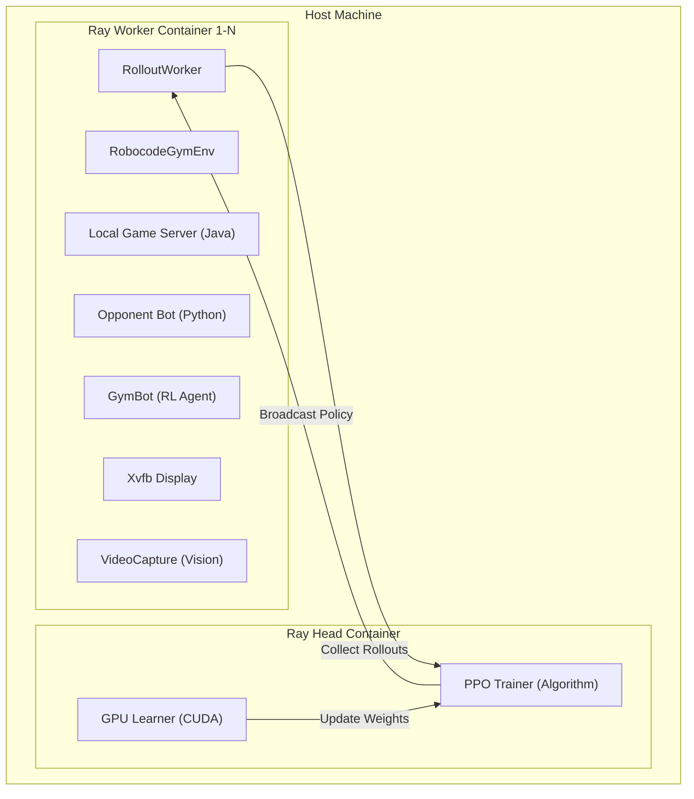

# RoboDojo: Stabilized Robocode RL Training Pipeline

RoboDojo is a high-performance, distributed reinforcement learning pipeline for training Robocode bots. It leverages Ray RLLib for PPO training and Docker for environment isolation, optimized for high-end hardware like the RTX 5090.

## 🏗️ Architecture

The pipeline uses a true distributed Ray cluster with dedicated Docker containers for each worker to ensure 100% environment isolation.

### 1. High-Level Cluster Architecture


### 2. Isolated Environment Detail
Each Ray worker container runs its own local Robocode server and display buffer. This eliminates "bot cross-talk" and allows for perfect 1v1 parallelization.

| Component        | Technology          | Responsibility                                    |
| :--------------- | :------------------ | :------------------------------------------------ |
| **PPO Trainer**  | Ray RLLib / PyTorch | Central algorithm and weight updates.             |
| **Local Server** | Java (v0.34.2)      | Physics engine and game simulation.               |
| **GymBot**       | Python / WebSockets | Async bridge between RLlib and the game.          |
| **VideoCapture** | mss / OpenCV        | Real-time pixel capture from Xvfb for CNN branch. |

---

## 🚀 User Guide

### 1. Prerequisites
- Docker & Docker Compose
- NVIDIA Container Toolkit (for GPU acceleration)
- XLaunch (if using visual debugging on Windows)

### 2. Getting Started
The project uses a **Makefile** and **Hydra** for simplified management.

```bash
# Start full-scale training (12 parallel workers)
make train

# Run a quick smoke test
make smoke-test

# Monitor logs
docker compose logs ray-head -f
```

### 3. Configuration (Hydra)
Settings are organized hierarchically in `config/`. You can override any value via CLI:
```bash
# Override learning rate and worker count
python -m src.train training.lr=1e-4 hardware.num_workers=5
```

### 4. Serving (Deployment)
Once a model is trained, export and run it as a standalone bot:
```bash
# Export the best weights
make serve
# (This runs export_model.py and starts inference_bot.py)
```

---

## 🛠️ Project Management
- **`pyproject.toml`**: Dependency and build configuration.
- **`Makefile`**: Quick-access shortcuts for training and serving.
- **`.agent/workflows/`**: Interactive workflows for the AI assistant.
- **`LICENSE`**: MIT Licensed.

---

## 📊 Verification Status
- ✅ **Distributed Isolation**: Resolved "Bots joined" collisions via strict loopback binding.
- ✅ **Memory Stability**: JVM capping and Docker limits prevent OOM crashes.
- ✅ **Numerical Stability**: Observation normalization ensures no NaN loss.
- ✅ **Async Robustness**: GymBot correctly handles high-frequency async server events.

---

## 📜 Citation

If you use RoboDojo in your research or project, please cite it as:

```bibtex
@software{robodojo2025,
  author = {{RoboDojo Team}},
  title = {RoboDojo: Stabilized Robocode RL Training Pipeline},
  version = {0.1.0},
  date = {2025-12-27},
  url = {https://github.com/iridescent-omega/robodojo},
  license = {MIT}
}
```

