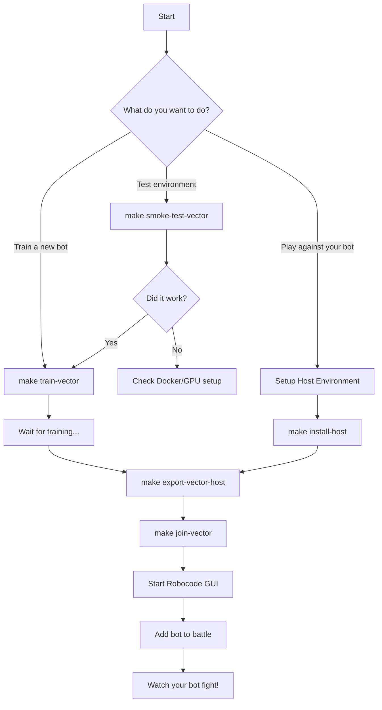

# RoboDojo User Guide

This guide walks you through the common workflows for training, deploying, and playing with your RoboDojo RL bot.

---

## 📋 Prerequisites

Before you begin, ensure you have:

| Requirement              |   For Training (Docker)   |    For Inference (Host)     |
| ------------------------ | :-----------------------: | :-------------------------: |
| Docker & Docker Compose  |        ✅ Required         |        ❌ Not needed         |
| NVIDIA Container Toolkit | ✅ Required (GPU training) |        ❌ Not needed         |
| Python 3.10+             |        ❌ Optional         |         ✅ Required          |
| CUDA-capable GPU         |       ✅ Recommended       |        ✅ Recommended        |
| Robocode Tank Royale GUI |       ❌ Not needed        | ✅ Required for manual games |

---

## 🚀 Quick Start Flowchart



---

## 🏋️ Training Workflow

### Step 1: Validate Your Environment
Before starting a long training run, verify everything works:

```bash
# Quick smoke test (vector-only, fastest)
make smoke-test-vector

# Full smoke test (with visual observations)
make smoke-test
```

### Step 2: Start Training

| Command               | Description                                                   |
| --------------------- | ------------------------------------------------------------- |
| `make train`          | Full training with visual observations (slower, richer input) |
| `make train-vector`   | Vector-only training (faster, recommended to start)           |
| `make train-resume`   | Resume from the last best checkpoint                          |
| `make train-selfplay` | Train against copies of itself only                           |

**Monitor training:**
```bash
docker compose logs ray-head -f
```

### Step 3: Stop Training
```bash
# Pause training (preserves checkpoints)
make stop

# Full cleanup (DELETES all checkpoints and logs!)
make clean
```

---

## 🤖 Inference & Deployment Workflow

Once you have a trained model, you can deploy it to play in real games.

### Step 1: Setup Host Environment (One-time)

If you haven't set up your local Python environment for inference:

```bash
# Create venv and install dependencies (torch, robocode-tank-royale, etc.)
make install-host
```

### Step 2: Export Model Weights

Convert the Ray checkpoint to a standalone PyTorch file:

| Command                   | When to Use                                   |
| ------------------------- | --------------------------------------------- |
| `make export-vector`      | Docker is running (uses container)            |
| `make export-vector-host` | Docker is NOT running (uses local venv + Ray) |
| `make export`             | Export multimodal (visual) model              |

This creates `artifacts/serving/bot_weights.pt`.

### Step 3: Join a Game

| Command             | Description                                             |
| ------------------- | ------------------------------------------------------- |
| `make join-vector`  | Join game at `ws://127.0.0.1:7688` with vector-only bot |
| `make join`         | Join game with multimodal (visual) bot                  |
| `make serve-vector` | Auto-export + join (convenient one-liner)               |

**Custom server URL:**
```bash
make join-vector URL=ws://192.168.1.100:7654
```

---

## 🎮 Playing Against Your Bot

### Step 1: Start Robocode Tank Royale GUI
1. Download and run [Robocode Tank Royale](https://github.com/niceTutor/Robocode-Tank-Royale/releases)
2. Go to **Server** → **Start Server** (default port: 7688)

### Step 2: Launch Your Bot
```bash
make join-vector
```

### Step 3: Add Bots to Battle
1. In the Robocode GUI, go to **Battle** → **Start Battle**
2. Select your `RoboDojoInference` bot from the connected bots list
3. Add opponent bots (e.g., sample bots like `Crazy`, `SpinBot`)
4. Click **Start Battle**

### Step 4: Watch the Fight!
Your RL agent will now compete. Check the terminal for tick logs:
```
Tick 100: avg inference=0.35ms, pos=(400,300), energy=95.2
```

---

## 📊 Data Collection Workflow

For imitation learning or analysis, you can collect expert demonstrations:

```bash
# Start data collection (watches sample bot battles)
make collect-expert

# Combine JSON files into training-ready .npz
make aggregate-data
```

---

## 🔧 Command Reference

Run `make help` for a full list:

```
TRAINING SCENARIOS:
  make train             - Start training from scratch (full cluster)
  make train-resume      - Resume training from the best checkpoint
  make train-selfplay    - Start training with self-play only
  make train-vector      - Train with VECTOR-ONLY obs (no visual)
  make smoke-test        - Run a quick validation test (multimodal)
  make smoke-test-vector - Run a quick validation test (vector-only)

SERVING & DEPLOYMENT:
  make export            - Convert the best checkpoint to standalone .pt
  make serve             - Export AND start the inference bot
  make serve-vector      - Serve with vector-only model
  make join              - Join a manual game on host (localhost:7654)
  make join-vector       - Join a manual game on host with vector-only bot

EXPERT DATA COLLECTION:
  make collect-expert    - Collect demonstration data from sample bots
  make aggregate-data    - Combine collected JSON data into .npz dataset

UTILITIES:
  make stop              - Stop the cluster (pauses training, keeps checkpoints)
  make clean             - Stop cluster and WIPE temporary logs/checkpoints (DANGEROUS)
```

---

## ⚠️ Troubleshooting

| Problem                                      | Solution                                            |
| -------------------------------------------- | --------------------------------------------------- |
| `ModuleNotFoundError: No module named 'src'` | Run commands from project root, use `python -m`     |
| `Weights file NOT FOUND`                     | Run `make export-vector-host` first                 |
| `service "ray-head" is not running`          | Use `export-vector-host` instead of `export-vector` |
| Bot moves slowly                             | Check that CUDA is detected (`initialised on cuda`) |
| `ArrowInvalid: URI has empty scheme`         | Paths must be absolute; this is auto-fixed now      |

---

## 📁 Key Files & Directories

| Path                               | Purpose                                |
| ---------------------------------- | -------------------------------------- |
| `artifacts/checkpoints/best/`      | Best training checkpoint (Ray format)  |
| `artifacts/serving/bot_weights.pt` | Exported PyTorch weights for inference |
| `artifacts/recordings/`            | Training episode recordings (.mp4)     |
| `config/`                          | Hydra configuration files              |
| `src/serving/inference_bot.py`     | Standalone bot for deployment          |
| `requirements.txt`                 | Host-side inference dependencies       |
